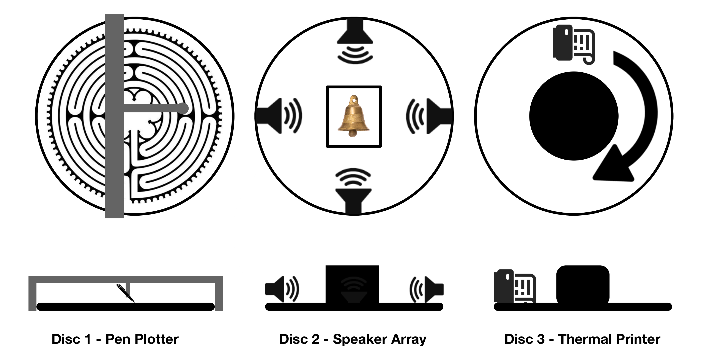
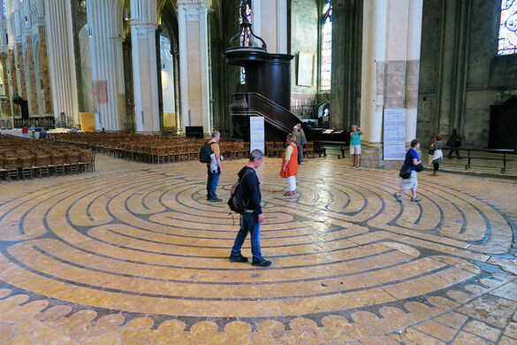

This is a conceptual overview of the "Pascal's Automata" project in its imagined, maximalist form. The project depicted here is a prototype. 

# Pascal's Automata 

## Overview

Pascal's Automata is a semi-autonomous system of generative art machines that continually produce small procedural artifacts in the style of religious art. The system consists of three modules arranged on three slowly rotating disks containing: 1) a pen plotter drawing labyrinth diagrams on round sheets of paper, 2) an array of speakers pointed at a box in the center of the disk containing small bells, and 3) a thermal "receipt printer" printing lines of generated text onto a continually coiling prayer wheel. The modules are powered by microcontrollers with the generative art algorithms running on a computer connected to the system. Each module completes a cycle on regular intervals, at which point a performer removes the generated artifact (paper with drawing, bell, or coil of receipt paper) and hangs it in the space around the object. An instance of the artwork will consist of a durational performance installation in a gallery with blank wall space suitable to display the entire output of the system during the course of its showing. 

## Background

 This work is an exploration of the relationship between ritual and automation. It seeks to inspire a dialogue between old spiritual practices and new technology, as well as interrogate the metaphysical implications of tech ideologies by attempting to enact, in artistic form, a transcendental experience through automata. 

The three elements are significant partly due to the numerological and theological significance of "three" (the trinity,  three levels of consciousness, three wise men, etc.), as well as representing the primary activities of religious devotion across many cultures: the production of religious art, music, and text. 

The title "Pascal's Automata" is a nod to the famous "Pascal's Wager"[^1] argument in theology. The work attempts to playfully extend that idea with the notion of actually automating the observance needed to fulfill the wager.

The piece is inspired by several sources and avenues of my own thought:  

- Arthur C. Clarke's seminal 1953 short story "The Nine Billion Names of God"[^2]in which early computer engineers construct a machine to automate a monastery's practice of exhaustively listing every possible combination of letters in a mystical alphabet that they believe will accurately state the name of God. Thus using computing power to find a "brute force" solution to a metaphysical problem. 
- The real application of robotic agents in actually existing religious communities, a phenomenon that is accelerating due to COVID and aging populations without access to clergy.[^3]
- The notion of automation or mathematical encoding that is present in many mystical religious traditions, especially the so called "Bible Code" popular in Jewish Kabbalah practice. [^4] 
- The increasingly mystical ideas popular within the tech industry relating to the singularity, simulation hypothesis, and technology. I am deeply suspicious of these trends and want to "enact" some implications of the ideas as a way of thinking through their contradictions and their resonances with traditional mystical thought. [^5] 
- Thardo Khorlo, or "Electric Dharma Wheels", motorized Tibetan Prayer wheels whose rotation can be considered an automatic application of prayer [^6]
- Sufi "whirling" practice (most famously the so called "whirling dervishes") where extended performances of repetitive motion evoke a trancelike state and can be considered a form of abstracted, simplified prayer.[^7] 
- The sculptural installations of artist Dario Robleto[^8], whose work explores the elevation of simple objects into the realm of the sacred through ritualized framing. 

## Design

The aesthetic presentation of the overall piece should be a hybrid between a laboratory space and a monastery, particularly a "Scriptorium" or manuscript room[^9], especially the fictional "*aedificium*" described in Umberto Eco's novel "The Name of the Rose"[^10].  Wiring should be exposed to emphasize the computer origin of the work, but should be coiled with exceptional care and reverence. The performance should be silent and diligent like the work of a monk or nun. 

### Disk 1 - Labyrinth Generator

This disk will be mounted with a small pen-plotter device that will be tracing generative artwork onto sheets of circular paper mounted to the disk. The artwork will follow the pattern of "labyrinth" designs, especially labyrinths popular in medieval cathedrals (most notably Chartres[^11]). The labyrinths will be generated by custom code written in processing and will include random generative variations based on seed integers from the Torah interpreted numerologically (where each letter represents an integer). Each labyrinth will represent one possible "mapping" of meaning onto segments of the old testament. 

### Disk 2 - Sacred Music Generator

This disk will consist of an array of speakers positioned at the edge of the disk facing inward. The speakers will cycle through iterative combinations of recordings religious music from a variety of traditions run through audio filters producing spatialize sound (as well as a subtle doppler effect from the spinning disk). The center of the disk holds a small bell inside of a ornately lined box which receives the audio from the rotating speakers. At the end of each cycle of material the bells are replaced, generating a series of bells that are "imprinted" with the spiritual tones.

The audio from this disk should be played at the lowest possible clear volume, so that the sound from this module is equivalent to the volume of the motors from the pen plotter and thermal printer, and only clearly discernible to a close listener.  The control algorithm will cycle through randomly selected pieces of public domain religious music and audio filters refracting the sound differently in each of the four speakers. 

### Disk 3 - Prayer Generator

The prayer generator module uses a text generation algorithm based on a corpus of sacred text and spiritual poetry from a wide variety of traditions. The algorithm generates novel strings of text based on a recombination of words and phrases from its corpus in response to user prompts. Each generated "prayer" is spooled onto an inner wheel on the disk where it rotates in the style of a Tibetan prayer wheel. After each cycle, the paper is removed and displayed along with the labyrinth drawings and bells.

The prompts into the system can be solicited from viewers who can write a name or question onto a slip of paper to be inputed into the system by a performer. Alternatively, the system can autonomously search for prompts using google trends or publicly available newsfeed APIs. 

## Conclusion

This piece is a framework for further exploration and development of the visual, sound, and text algorithms that power the three modules, which can grow in response to new research and larger bodies of of material. They could also be customized for particular showing contexts by, for instance, selecting material from one tradition for a culturally specific performance. 

Through performance of the work and development of the algorithms, I hope to explore moments of playful and ironic recontextualization of religious material that provoke real reflection on the theological implications of technology. Ultimately, the work seeks to ground the possibility of an "artificial spirituality" for further exploration in art and research.   

[^1]: [Pascal's Wager](https://plato.stanford.edu/entries/pascal-wager/)

[^2]: ["The Nine Billion Names of God", Arthur C. Clarke](https://en.wikipedia.org/wiki/The_Nine_Billion_Names_of_God)

[^3]: ["Robot priests can bless you, advise you, and even perform your funeral", by Sigal Samuel, vox.com 1/13/2020](https://www.vox.com/future-perfect/2019/9/9/20851753/ai-religion-robot-priest-mindar-buddhism-christianity)

[^4]: [This is exmplified well by this clip by Darren Aranofsky's 1998 film "Pi"](https://www.youtube.com/watch?v=3vi7043z6tI) 

[^5]: ["Tech Billionaires Want to Destroy the Universe" by Sam Kriss, The Atlantic, 10/13/2016](https://www.theatlantic.com/technology/archive/2016/10/silicon-valley-is-obsessed-with-a-false-notion-of-reality/503963/)

[^6]: [https://en.wikipedia.org/wiki/Prayer_wheel#Electric_dharma_wheels](https://en.wikipedia.org/wiki/Prayer_wheel#Electric_dharma_wheels)
[^7]: ["Sufi Whirling Dervishes", PBS, 12/13/2013](https://www.pbs.org/wnet/religionandethics/2013/12/13/february-1-2013-sufi-whirling-dervishes/14517/)
[^8]: [Dario Robleto](http://www.dariorobleto.com/works)
[^9]: [Sciptorium](https://en.wikipedia.org/wiki/Scriptorium)
[^10]: [The "aedificium" from Eco's novel, which provided some inspiration for the ideas in this piece and could serve as a guide to the asethetic for its installation](https://en.wikipedia.org/wiki/The_Name_of_the_Rose#The_aedificium's_labyrinth)
[^11]: [The Labyrinth of Chartres Cathedral](https://www.luc.edu/medieval/labyrinths/chartres.shtml)
