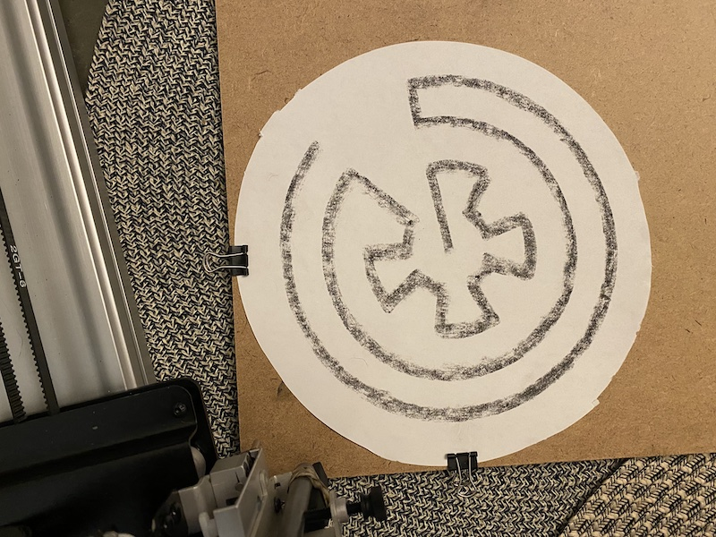

# Pascal's Automata

https://user-images.githubusercontent.com/65256014/130068457-ef01dbbd-7e68-49d2-aca0-18e5e4e446f3.mp4

University of Washington DXARTS 470 Final Project
Edward Wolcher

## Overview

This project is a conceptual prototype for a mechatronic installation / performance about the automation of religious practice and the possibilities of artificial spirituality.

The prototype has code for an Arduino-based text-generation algorithm and control system that powers a thermal (receipt) printer and a DC motor controlling a spinning display platter. It is triggered simultaneously with a codebase powering a pen-plotter that generates randomized SVG code of religious "labyrinth" plots. 

The receipt printer generates a "Prayer Cycle" consisting of 8 randomized prayers (from a possible combinatorial space of ~64,000) and a barcode indicating the unique timestamp of the prayer. The pen-plotter simultaneously plots a generated labyrinth. 

The labryinth is based on a [self-avoiding random walk](https://en.wikipedia.org/wiki/Self-avoiding_walk) in a very small configuration space (5x9) which allows the javascript code to create a solution in a few moments. The total number of possible walks even in that small space is unprovably large.

The systems together create a continuously updated religious ritual inspired most specifically by Arthur C. Clarke's classic short story [*The Nine Billion Names of God*](https://en.wikipedia.org/wiki/The_Nine_Billion_Names_of_God). Though the amount of time to generate all possible iterations of its ritual act far outstretches the possible lifespan of planet Earth, I find something profound in the possibility that the machine could continually iterate through these practices and inevitably hit on something "real".

## Conceptual Background

For a detailed explanation of the conceptual framework of this piece please see the "concept.md" file. 

## Code Explanation

The codebase is primarily C++ Arduino code contained in the "ritual" folder. The "Text.h" library contains the combinatorial lists for prayer generation. The main trick in the code is reading the textual data into a string buffer for random assignment.

The SVG generation is accomplished via an implementation of the Processing framework and is contained within the "labyrinth_generator" folder. SVG drawing is tiggered along with arduino code. 

## Images

